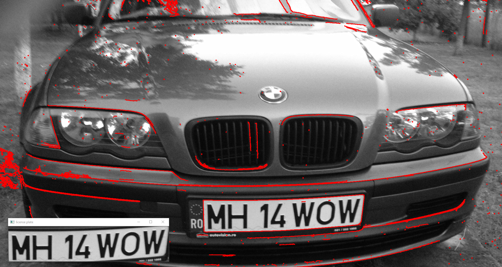
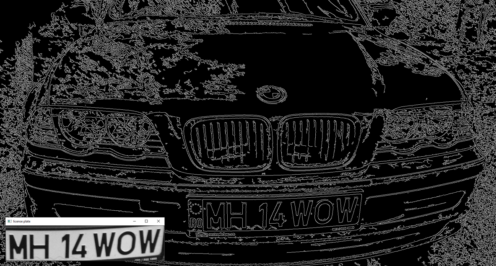

# Image Processing Course - Project

## License Plate Detector in C++ using OpenCV

   Technical University of Cluj-Napoca\
   Computer Science - 3rd Year\
  2021, Spring

## **Usage**

### Clone the repository

**``
git clone https://github.com/blasio99/LicensePlateDetector_CPP.git
``**

## **Description**

### Requirements

- Color images of vehicles (at different distances) with visible license plate are provided (the license plate can be a little bit rotated to the horizontal direction)
- There is implemented an algorithm to identify and mark the areas where the license plates are found

### Basic steps on the approach

1. Image acquiring
2. Grayscale conversion
3. Noise reduction
4. Image thresholding
5. Canny Edge detection algorithm
6. Connected Component Labeling
7. Choosing th best candidate

### STEP 1 & 2

Loading the image should be the easiest part, because of the functionalities offered by OpenCV.  
The image color is converted to grayscale while reading.  
Big advantage of grayscale images is that it saves up a lot of memory and it is easier to work with them.

### STEP 3 & 4

Reduce the noise present in the image using some gaussian filters (mathematical properties)

- Reduce unwanted information which deteriorates image quality.
- Apply Gaussian convolution (ID = G * IS) - implementation may vary

Apply thresholding process to obtain a binary image ( black and white image suitable for Canny algorithm)

### STEP 5

The steps of the Canny edge detection method are given below

1. Noise filtering through a Gaussian Kernel
2. Computing the gradient’s module and direction
3. Non-maxima suppression of the gradient’s module
4. Edge linking through adaptive hysteresis thresholding

### STEP 6 & 7

Label the same neighbouring pixels that belong to the same object.

- for this process a binary image is needed ( output of the Canny algorithm )

Finally, from those components, select the suitable one based on some mathematical and logical principles and rules.

## Visualization

Algorithm presentation:

## **Contributing**

Contributions are what make the open source community such an amazing place to be learn, inspire, and create. Any contributions you make are **greatly appreciated**.  

- Fork the Project  
- Create your Feature Branch ( **`git checkout -b feature/AmazingFeature`** )
- Commit your Changes ( **`git commit -m 'Add some AmazingFeature'`** )
- Push to the Branch ( **`git push origin feature/AmazingFeature`** )
- Open a Pull Request  

## **Contact**

- Benedek Balázs - [LinkedIn Profile](https://www.linkedin.com/in/balazs-benedek-009322183/)
- E-mail: benedekbalazs1999@gmail.com
- Project Link: [GitHub - License Plate Detector](https://github.com/blasio99/LicensePlateDetector_CPP)
